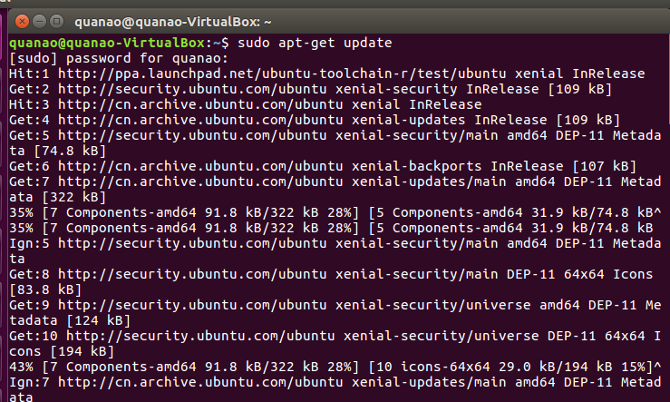
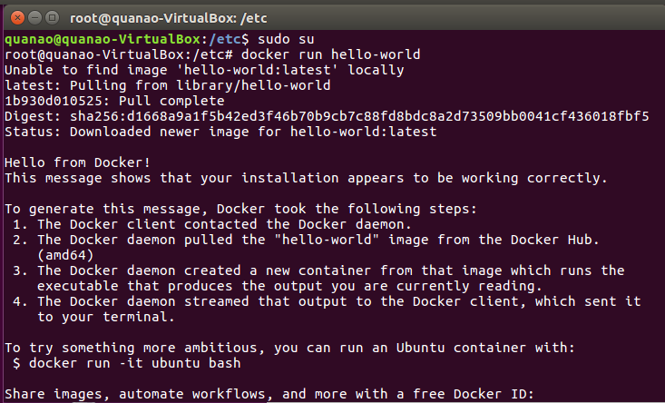

# docker部署与应用-17343098-全奥
## 1. docker安装
```
 sudo apt-get update
 sudo apt-get install docker-ce docker-ce-cli containerd.io
 ```
 




## 2. 使用单台服务器，使用 docker 部署 go web 应用

## 3. 掌握 docker 的简单操作

## 4. 学会使用 dockerfile 构建服务容器

## 5. 学会使用 docker-compose 部署应用