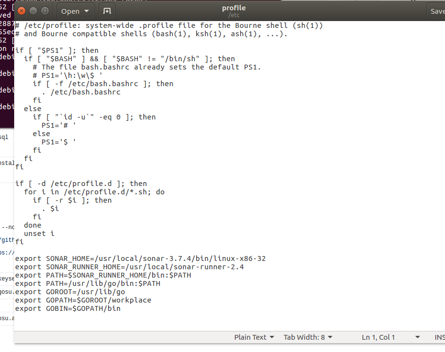
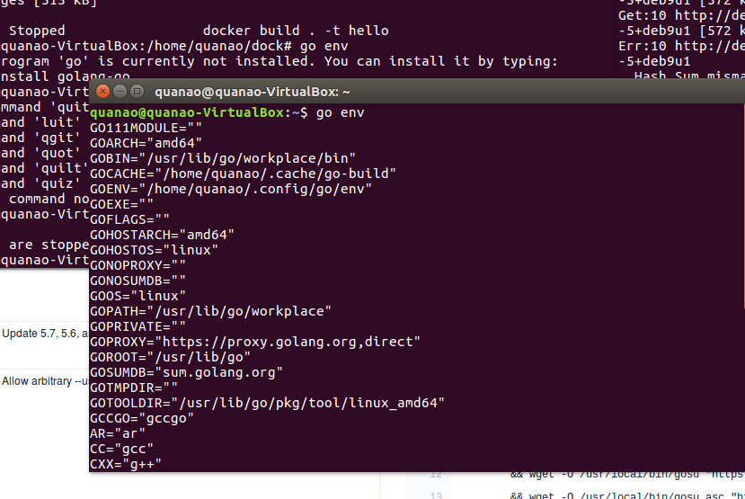
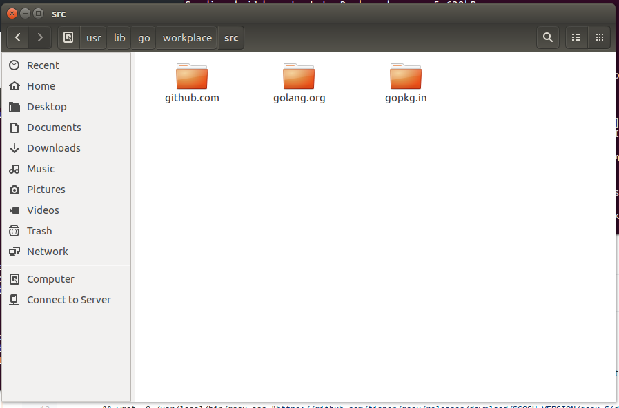
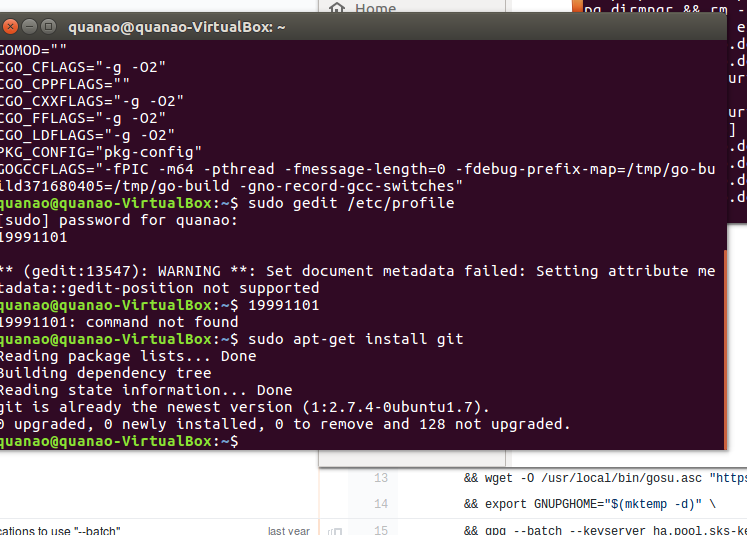
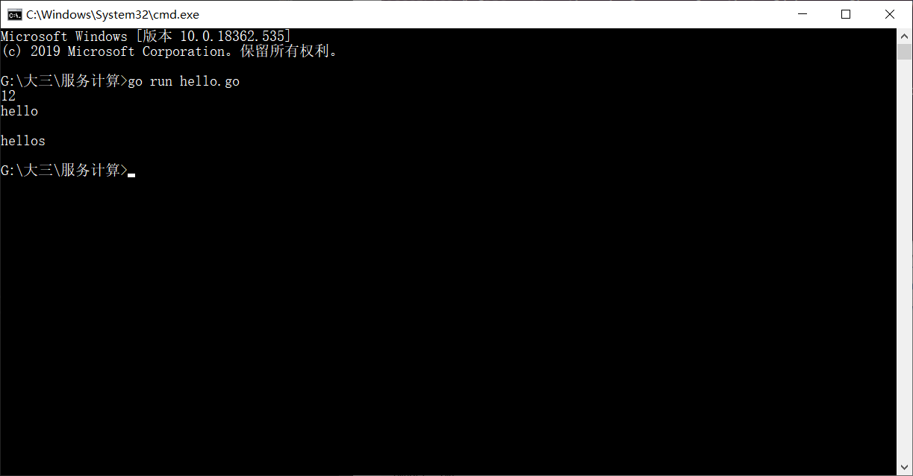
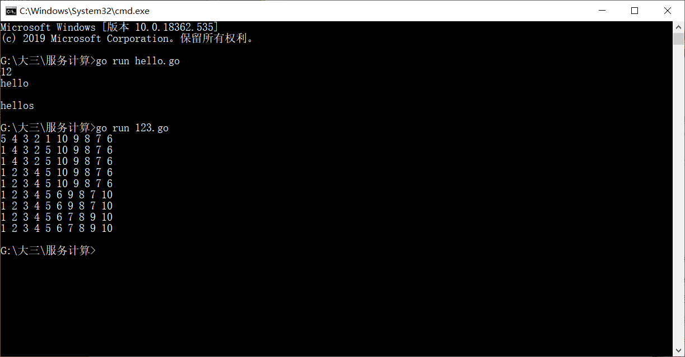

# 安装 go 语言开发环境-17343098-quanao全奥

## 1. 安装 golang
官网下载安装包：
[https://golang.org/]
设置好GOROOT,GOPATH,GOBIN


## 2. 安装go的一些包
使用go get +github.com/xx 获取你想要的包

安装git


## 3. 测试hello world
 windows下测试的：
 ```
 package main
import "fmt"
func main(){
	var a,b int =60,13
	fmt.Println(a&b)
	fmt.Println("hello\n")
	fmt.Println("hellos")

}
 ```
 

 ## 4. 运行测试快速排序
```
package main
import 	("fmt")

func main(){
	var array [10]int
	input_num(array[:])
	quick_sort(array[:],0,9)
}
func input_num(array []int){
	var length int=len(array)
	for i:=0;i<length;i++ {
		fmt.Scanf("%d",&array[i])
	}
	return
}
func quick_sort(array []int,begin int,end int){
	if (begin>=end) || ((begin-end)==1) {
		return
	}
	//var length int=len(array)
	var end_index int=end
	var begin_index int=begin
	for end_index>begin{
		if end_index==begin{
			var num int =array[end_index]
			array[end_index]=array[begin]
			array[begin]=num
			break
		}
		if array[end_index]<array[begin]{
			
			for begin_index<end_index{
				if(array[begin_index]>array[begin]){
					break
				}
				begin_index++
			}
			if(begin_index==end_index){
				var num int =array[end_index]
				array[end_index]=array[begin]
				array[begin]=num
				break
			}else{
				var num int =array[end_index]
				array[end_index]=array[begin_index]
				array[begin_index]=num
			}
			
		}
		end_index--
	}
	print_array(array[:])
	quick_sort(array[:],begin,end_index-1)
	quick_sort(array[:],end_index+1,end)
	return
}
func print_array(array []int){
	for i:=0;i<len(array);i++{
		fmt.Printf("%d ",array[i])
	}
	fmt.Printf("\n")
	return
}
```
 